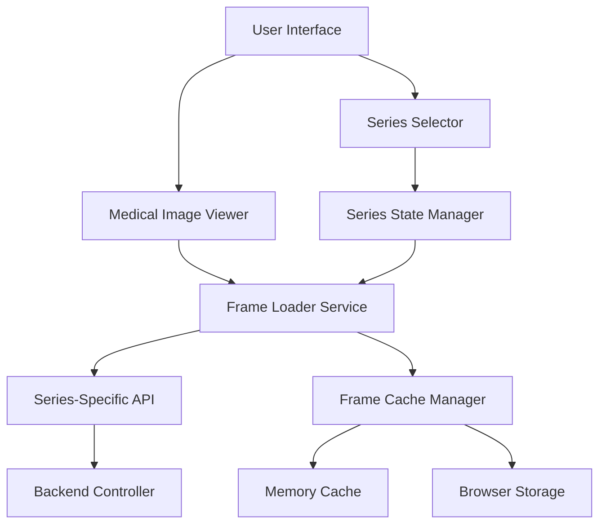

# Design Document: Series-Wise Image Loading

## Overview

This design implements proper series-wise image loading for the medical imaging viewer. The current system loads images sequentially across all series in a study, but users need to view images organized by their DICOM series structure. This enhancement will modify the viewer to load and display images according to their series organization, providing better navigation and user experience.

## Architecture

The solution involves modifications to three main layers:

1. **Frontend Viewer Layer**: Update the MedicalImageViewer component to handle series-specific frame loading
2. **API Layer**: Ensure series-specific endpoints are properly utilized
3. **Caching Layer**: Implement series-aware frame caching



## Components and Interfaces

### 1. Enhanced MedicalImageViewer Component

**Location**: `viewer/src/components/viewer/MedicalImageViewer.tsx`

**Key Changes**:
- Add series-aware state management
- Modify frame loading to use series-specific endpoints
- Update navigation logic to respect series boundaries
- Implement series-specific frame caching

**New Props**:
```typescript
interface SeriesAwareMedicalImageViewerProps {
  studyInstanceUID: string
  selectedSeriesUID: string
  seriesData: SeriesInfo[]
  onSeriesChange?: (seriesUID: string) => void
}

interface SeriesInfo {
  seriesInstanceUID: string
  seriesNumber: number
  seriesDescription: string
  modality: string
  numberOfInstances: number
  instances: InstanceInfo[]
}
```

### 2. Series State Manager

**New Service**: `viewer/src/services/seriesStateManager.ts`

**Responsibilities**:
- Track current series selection
- Maintain frame positions for each series
- Handle series switching logic
- Persist series state in session storage

**Interface**:
```typescript
interface SeriesStateManager {
  getCurrentSeries(): string | null
  setCurrentSeries(seriesUID: string): void
  getCurrentFrame(seriesUID: string): number
  setCurrentFrame(seriesUID: string, frameIndex: number): void
  getSeriesFrameCount(seriesUID: string): number
  resetSeriesState(): void
}
```

### 3. Enhanced Frame Loader Service

**Location**: `viewer/src/services/frameLoader.ts` (new file)

**Responsibilities**:
- Load frames using series-specific API endpoints
- Implement series-aware caching strategy
- Handle preloading of adjacent frames within series
- Manage cache eviction policies

**Interface**:
```typescript
interface FrameLoaderService {
  loadFrame(studyUID: string, seriesUID: string, frameIndex: number): Promise<ImageBitmap>
  preloadFrames(studyUID: string, seriesUID: string, startIndex: number, count: number): Promise<void>
  clearSeriesCache(seriesUID: string): void
  getCacheStats(): CacheStats
}
```

### 4. Updated Series Selector Component

**Location**: `viewer/src/components/viewer/SeriesSelector.tsx`

**Enhancements**:
- Add frame count display for each series
- Show current frame position when series is active
- Implement keyboard navigation between series
- Add series preview thumbnails (future enhancement)

## Data Models

### Series Frame Cache Structure

```typescript
interface SeriesFrameCache {
  [studyUID: string]: {
    [seriesUID: string]: {
      frames: Map<number, ImageBitmap>
      metadata: SeriesMetadata
      lastAccessed: number
      frameCount: number
    }
  }
}

interface SeriesMetadata {
  seriesInstanceUID: string
  seriesNumber: number
  seriesDescription: string
  modality: string
  numberOfInstances: number
}
```

### Series Navigation State

```typescript
interface SeriesNavigationState {
  currentSeriesUID: string
  seriesFramePositions: Map<string, number>
  seriesMetadata: Map<string, SeriesMetadata>
  totalSeriesCount: number
}
```

## Implementation Details

### 1. Frame Loading Logic

The frame loading will be updated to use series-specific endpoints:

```typescript
const loadFrame = useCallback(async (frameIndex: number) => {
  if (!selectedSeriesUID) return null
  
  // Check cache first
  const cacheKey = `${studyInstanceUID}-${selectedSeriesUID}-${frameIndex}`
  if (frameCacheRef.current.has(cacheKey)) {
    return frameCacheRef.current.get(cacheKey)
  }

  // Use series-specific endpoint
  const frameUrl = `${dicomWebBaseUrl}/studies/${studyInstanceUID}/series/${selectedSeriesUID}/frames/${frameIndex}`
  
  try {
    const response = await fetch(frameUrl, { signal: AbortSignal.timeout(10000) })
    if (!response.ok) throw new Error(`HTTP error! status: ${response.status}`)
    const blob = await response.blob()
    const bitmap = await createImageBitmap(blob)
    
    // Cache with series-specific key
    frameCacheRef.current.set(cacheKey, bitmap)
    return bitmap
  } catch (err) {
    console.error(`Frame load error for series ${selectedSeriesUID}:`, err)
    return null
  }
}, [dicomWebBaseUrl, studyInstanceUID, selectedSeriesUID])
```

### 2. Navigation Boundaries

Update navigation to respect series boundaries:

```typescript
const handleFrameNavigation = useCallback((direction: 'next' | 'prev') => {
  if (!selectedSeriesUID) return
  
  const currentSeriesData = seriesData.find(s => s.seriesInstanceUID === selectedSeriesUID)
  if (!currentSeriesData) return
  
  const maxFrames = currentSeriesData.numberOfInstances
  
  setCurrentFrame(prev => {
    if (direction === 'next') {
      return Math.min(prev + 1, maxFrames - 1)
    } else {
      return Math.max(prev - 1, 0)
    }
  })
}, [selectedSeriesUID, seriesData])
```

### 3. Series Switching Logic

Implement smooth series switching with state preservation:

```typescript
const handleSeriesChange = useCallback((newSeriesUID: string) => {
  // Save current frame position for current series
  if (selectedSeriesUID) {
    seriesStateManager.setCurrentFrame(selectedSeriesUID, currentFrame)
  }
  
  // Switch to new series
  setSelectedSeriesUID(newSeriesUID)
  
  // Restore frame position for new series or start at 0
  const savedFrame = seriesStateManager.getCurrentFrame(newSeriesUID)
  setCurrentFrame(savedFrame)
  
  // Preload first few frames of new series
  preloadSeriesFrames(newSeriesUID, 0, 3)
}, [selectedSeriesUID, currentFrame, seriesStateManager])
```

### 4. Cache Management

Implement intelligent caching with series awareness:

```typescript
class SeriesFrameCache {
  private cache = new Map<string, ImageBitmap>()
  private accessTimes = new Map<string, number>()
  private maxCacheSize = 50 // frames
  
  set(studyUID: string, seriesUID: string, frameIndex: number, bitmap: ImageBitmap) {
    const key = `${studyUID}-${seriesUID}-${frameIndex}`
    
    // Evict old frames if cache is full
    if (this.cache.size >= this.maxCacheSize) {
      this.evictOldestFrames(10)
    }
    
    this.cache.set(key, bitmap)
    this.accessTimes.set(key, Date.now())
  }
  
  get(studyUID: string, seriesUID: string, frameIndex: number): ImageBitmap | null {
    const key = `${studyUID}-${seriesUID}-${frameIndex}`
    const bitmap = this.cache.get(key)
    
    if (bitmap) {
      this.accessTimes.set(key, Date.now()) // Update access time
    }
    
    return bitmap || null
  }
  
  clearSeries(seriesUID: string) {
    for (const [key] of this.cache) {
      if (key.includes(`-${seriesUID}-`)) {
        this.cache.delete(key)
        this.accessTimes.delete(key)
      }
    }
  }
  
  private evictOldestFrames(count: number) {
    const entries = Array.from(this.accessTimes.entries())
      .sort(([,a], [,b]) => a - b)
      .slice(0, count)
    
    for (const [key] of entries) {
      this.cache.delete(key)
      this.accessTimes.delete(key)
    }
  }
}
```

## Error Handling

### 1. Series Loading Failures

- Fallback to study-level frame loading if series-specific endpoint fails
- Display user-friendly error messages for network issues
- Implement retry logic with exponential backoff

### 2. Invalid Series Selection

- Validate series existence before switching
- Fallback to first available series if selected series is invalid
- Handle cases where series metadata is incomplete

### 3. Frame Loading Errors

- Show placeholder images for failed frame loads
- Log detailed error information for debugging
- Implement graceful degradation for partial series failures

## Testing Strategy

### Unit Tests

- Test series state management functions
- Test frame cache operations
- Test navigation boundary logic
- Test error handling scenarios

### Property-Based Tests

The correctness properties will be defined after completing the prework analysis.

### Integration Tests

- Test complete series switching workflow
- Test frame loading across multiple series
- Test cache behavior under various scenarios
- Test error recovery mechanisms

### Performance Tests

- Measure frame loading times for different series sizes
- Test cache efficiency and memory usage
- Validate preloading performance impact
- Test navigation responsiveness

## Correctness Properties

*A property is a characteristic or behavior that should hold true across all valid executions of a system-essentially, a formal statement about what the system should do. Properties serve as the bridge between human-readable specifications and machine-verifiable correctness guarantees.*

### Property 1: Series Isolation
*For any* study with multiple series, when a series is selected, all displayed images should belong only to that series and navigation should remain within that series boundaries regardless of input method (mouse wheel, keyboard, or UI controls)
**Validates: Requirements 1.1, 1.2, 4.1, 4.2, 4.3, 4.4**

### Property 2: Series Selection State Management
*For any* series selection change, the viewer should switch to display the new series, update visual indicators, reset to the appropriate frame position, and maintain separate state for each series
**Validates: Requirements 1.3, 1.4, 2.3, 2.4**

### Property 3: Series Selector Completeness
*For any* study, the series selector should display all available series with complete metadata (number, description, modality, image count) when multiple series exist, and be hidden when only one series exists
**Validates: Requirements 2.1, 2.2, 2.5**

### Property 4: Series-Specific API Usage
*For any* frame request, the image loader should use series-specific API endpoints with proper study and series identifiers in the URL format
**Validates: Requirements 3.1**

### Property 5: Series-Aware Caching
*For any* frame caching operation, cache keys should include both study and series identifiers, and each series should maintain separate frame counts and metadata
**Validates: Requirements 3.2, 3.4**

### Property 6: Intelligent Frame Preloading
*For any* series selection or activation, the image loader should prioritize loading the first frame immediately and preload adjacent frames in the background
**Validates: Requirements 3.3, 7.1, 7.2**

### Property 7: Error Handling and Fallback
*For any* API request failure, the image loader should provide appropriate error handling, fallback mechanisms, and retry logic with exponential backoff
**Validates: Requirements 3.5, 7.5**

### Property 8: Default Series Selection
*For any* study loading, the viewer should automatically select the first series as the default selection
**Validates: Requirements 1.5**

### Property 9: Series-Specific Overlay Information
*For any* series display, the overlay should show correct series-specific information including description, number, frame position within series, total frames in series, and modality
**Validates: Requirements 5.1, 5.2, 5.3, 5.4, 5.5**

### Property 10: Session State Persistence
*For any* navigation away from viewer and return, or page refresh, the viewer should restore the previously selected series and maintain frame positions for all series in the current study session
**Validates: Requirements 6.1, 6.2, 6.3, 6.4**

### Property 11: Study State Cleanup
*For any* new study loading, the viewer should clear all previous session data and start with fresh state
**Validates: Requirements 6.5**

### Property 12: Cache Memory Management
*For any* frame loading operations, the image loader should maintain cache within memory limits through eviction policies while retaining recently viewed frames when switching series
**Validates: Requirements 7.3, 7.4**

## Migration Strategy

### Phase 1: Backend Compatibility
- Ensure series-specific API endpoints are working correctly
- Add proper error handling for missing series data
- Implement fallback mechanisms for legacy data

### Phase 2: Frontend Updates
- Update MedicalImageViewer component with series awareness
- Implement series state management
- Add enhanced caching layer

### Phase 3: UI Enhancements
- Update SeriesSelector with new features
- Add series-specific metadata display
- Implement keyboard shortcuts for series navigation

### Phase 4: Performance Optimization
- Fine-tune caching strategies
- Implement intelligent preloading
- Add performance monitoring and metrics